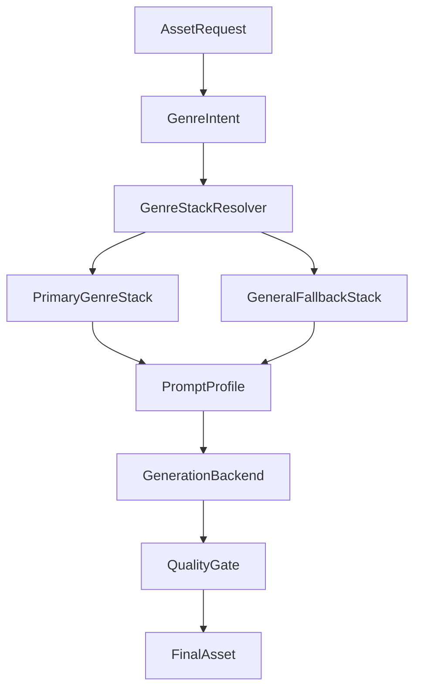
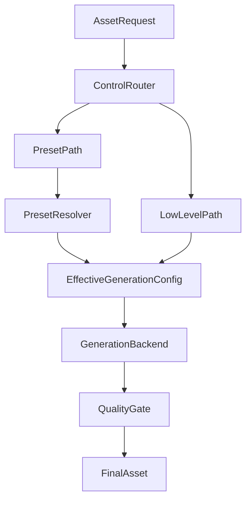

# Genre Asset Generation Architecture

> Status: draft v0.2  
> Scope: planning-only (no runtime implementation changes in this phase)

---

## 1. Purpose

Define a genre-focused generation architecture for game object assets so requests can route to:

- a genre-specific model stack when available
- a general fallback stack when genre coverage is partial or missing

Target genres for this phase:

- wuxia
- fantasy
- sci-fi
- horror
- historical
- modern
- general fallback

---

## 2. Design Goals

- Keep outputs stylistically consistent within a genre.
- Keep routing deterministic and auditable.
- Allow gradual model expansion without breaking current behavior.
- Keep runtime safe under current VRAM constraints.

Non-goals in this phase:

- no code-level router implementation
- no model download automation implementation
- no benchmark runner implementation

---

## 3. Asset Taxonomy

All generation prompts and evaluation should bind to both genre and object class:

- environment props (trees, rocks, ruins, machines)
- economy/interaction objects (mines, chests, shrines, portals)
- obstacles/blockers (cliffs, walls, wreckage)
- landmarks/POI (temples, towers, monuments)
- control/ownership markers (flags, posts, outposts)
- decor fillers (small clutter tiles, set dressing)

This gives a stable prompt schema:

- `genre`
- `object_class`
- `subtheme`
- `material palette`
- `tile readability constraints`

---

## 4. Routing Architecture

### 4.1 Stack Resolver Rules

Resolver output shape:

- `base_model`
- `optional_lora_set`
- `prompt_profile`
- `fallback_reason` (nullable)

Routing policy:

- use primary stack when genre status is `ready`
- use primary stack + fallback base when genre status is `partial`
- use fallback stack when genre status is `missing`

### 4.2 General Fallback

Fallback must always exist and be stable. It is the default for:

- unknown genre labels
- low-confidence genre mapping
- temporarily disabled genre stacks

---

## 5. Prompt Profile Layer

Each genre has a profile:

- style adjectives
- negative prompt defaults
- composition constraints for map readability
- color/contrast guidance
- texture density guidance

This decouples style control from model selection and lets a single base model serve multiple genres during partial coverage stages.

---

## 6. Quality Gate (Planning Contract)

Each generated asset should pass minimum checks:

- silhouette clarity at small scale
- object/background separation
- genre consistency with requested theme
- no severe artifacts (warping, unreadable details)

Initial rollout can be manual review. Later, this can be semi-automated.

---

## 7. Control Model For Users And LLM Agents

The service should support two request-control layers so advanced callers and
automation agents can both work efficiently:

- **Low-level generation controls** (direct):
  - `model`
  - `loras[]`
  - `prompt` / `negative_prompt`
  - runtime params (`size`, `steps`, `cfg`, `seed`, sampler/scheduler)
- **High-level asset preset controls** (composed):
  - `asset_type`
  - `preset_id`
  - `variables`
  - `overrides`

Resolver responsibilities for the high-level path:

1. Bundle resolution (`model` + default LoRAs)
2. Prompt template expansion from `variables`
3. Constraint validation for allowed override ranges
4. Emission of traceable effective config for audit/review

### 7.1 Runtime Lifecycle Policy (Model/Bundle Reload Behavior)

For generalized asset generation, callers need a clear runtime-policy switch:

- `runtime_mode: manual`
  - Caller/operator explicitly controls lifecycle via admin runtime endpoints.
  - Typical flow: reload registry -> setup bundle -> generate -> close bundle.
  - Best for deterministic benchmark passes and batch review sessions.
- `runtime_mode: auto`
  - Request provides `preset_id` or explicit bundle hints.
  - Service performs internal `ensure_bundle_active(...)` before generation.
  - Best for user/LLM convenience, where callers should not orchestrate internals.

Recommended default posture:

- external user/LLM traffic: `auto`
- operator pipelines and controlled experiments: `manual`

Decision table:

| runtime_mode | Bundle not active | Expected behavior |
|---|---|---|
| `manual` | yes | fail fast (`bundle_not_active`) with guidance |
| `auto` | yes | service acquires runtime lock, switches/warms bundle, then proceeds |
| `manual` | no | proceed directly |
| `auto` | no | proceed directly (no-op ensure) |

---

## 8. Current Baseline Constraints

Current registered runtime models are only:

- `noobai-xl-v1.1`
- `chroma-hd-q8`
- `terrain-chinese-v10`
- `terrain-sdxl-base`
- `terrain-dreamshaper`

Genre routing is still evolving, but tile-generation testing now has a validated
lane (`terrain-sdxl-base` + texture-focused LoRAs) suitable for controlled
preset experimentation.

---

## 9. Governance For New Genre Models

Before adding a model into genre routing:

1. Artifact integrity
   - file exists in correct model folder
   - checksum recorded in catalog
2. Compatibility
   - workflow compatibility verified
   - VAE/text-encoder requirements documented
3. Style fitness
   - sample set reviewed for target genre/object classes
4. Runtime fitness
   - VRAM feasibility checked
   - generation latency acceptable
5. Registration policy
   - decide: runtime-registered now vs catalog-only candidate

---

## 10. Tile-Generation Sub-Architecture Pointer

Detailed tile-generation architecture, taxonomy, preset flow, and evaluation
protocol are defined in:

- `docs/architecture/tile-generation-architecture.md`
- `docs/architecture/preset-contract.md`

---

## 11. Decision Log (This Phase)

- Use split docs: architecture + model catalog.
- Keep content scope unrestricted by genre content type, but route mature-theme assets only through optional profiles.
- Keep implementation unchanged until catalog and download queue are approved.
- Priority rollout genres: fantasy, wuxia, sci-fi.
- Download sources: Civitai + HuggingFace.
- Quality gate mode: manual + simple checklist scoring.
- Registration mode for new models: download + catalog first.

---

## 12. Next Step

Use `docs/architecture/genre-model-catalog.md` as the operational companion:

- current inventory
- per-genre coverage
- gap analysis
- prioritized download queue
- tile texture pass findings and validated preset references

Next implementation phase should consume shared preset terms:

- `asset_type`
- `preset_id`
- `variables`
- `overrides`
