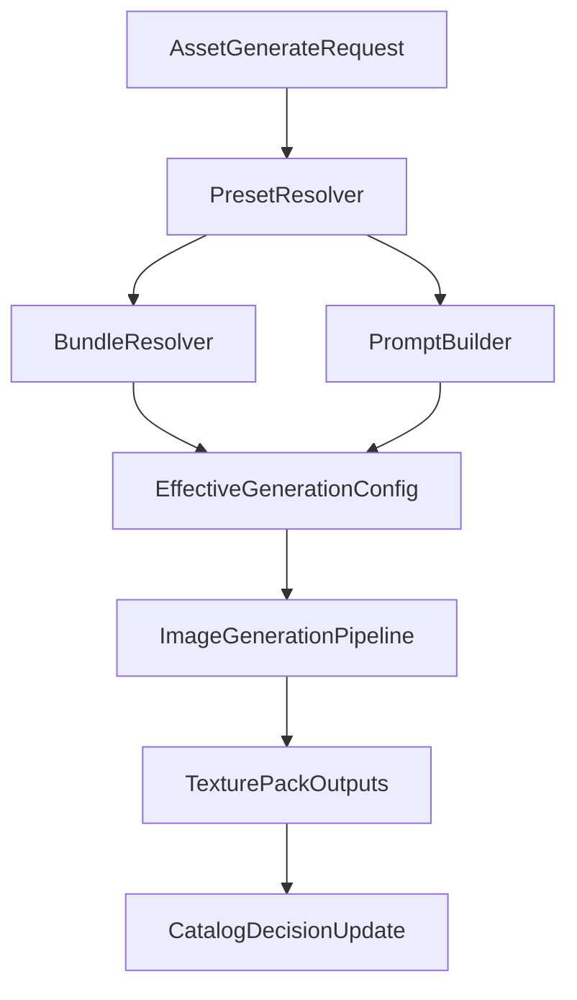

# Tile Generation Architecture

> Status: draft v0.1  
> Scope: architecture and workflow contract for terrain tile texture generation

---

## 1. Purpose

Define a repeatable tile-generation architecture that stays controllable by:

- human operators
- external services
- LLM agents

while preserving reproducibility and quality tracking across model/LoRA/prompt changes.

---

## 2. Tile Asset Taxonomy

### 2.1 Base Textures

- `grass_dirt`
- `snow_ice`
- `desert_sand`
- `swamp_mud`
- `lava_volcanic`
- `water_coast`

### 2.2 Transition Textures (next stage)

- terrain-pair blends (example: `grass_dirt_to_swamp_mud`)
- edge-aware texture ramps for map stitching

### 2.3 Overlay Textures (next stage)

- cracks
- pebbles
- puddles
- debris
- foam streaks

### 2.4 Future Optional Lane

- normals/roughness/height texture outputs for engine-level material workflows

---

## 3. Request And Control Flow

Tile generation should support both direct low-level control and high-level preset control.

Effective config must be persisted per run (model, loras, prompt, negative prompt, size, steps, cfg, seed, output path).

### 3.1 Tile Runtime Lifecycle Modes

Tile generation uses the shared runtime lifecycle policy:

- `runtime_mode: manual`
  - Requires bundle to be pre-activated by operator flow.
  - Intended for controlled pass runs (`multi-seed`, fixed candidate comparisons).
- `runtime_mode: auto`
  - Service resolves preset bundle and auto-switches when needed.
  - Intended for interactive usage and agent-driven generation.

Manual mode operator sequence:

1. `reload-registry`
2. `setup-bundle`
3. tile generation pass
4. optional `close-bundle`

Auto mode sequence:

1. incoming tile request (`preset_id` + `variables` + optional `overrides`)
2. service `ensure_bundle_active(...)` under runtime lock
3. generation execution
4. keep bundle warm unless explicit policy says close

---

## 4. Prompt Strategy For Tile Textures

### 4.1 Material-View Prompting (required)

Describe the output as a close-up material surface:

- fills entire frame
- close-up ground view
- organic surface detail

Avoid map-composition framing:

- no world-map layout
- no zoomed-out scene
- no cell grid framing

### 4.2 Baseline Negative Constraints

- `grid lines`
- `tile borders`
- `cell pattern`
- `map view`
- `zoomed out`
- `multiple tiles`
- `tiled arrangement`
- character/creature filters
- anti-soft/washed-out constraints

---

## 5. Candidate Evaluation Protocol

### 5.1 Pass Structure

- Per candidate combo: run all 6 terrain families
- Multi-seed pass for consistency (`101`, `202`, `303`)
- Fixed technical defaults during a pass:
  - size `1024x1024`
  - steps `28`
  - cfg `5.5`

### 5.2 Acceptance Gate

Candidate is accepted for tile texture lane when:

1. No major grid/cell artifacts on most outputs
2. Terrain family identity remains clear
3. Cross-seed consistency is acceptable
4. Output is suitable for downscale/packing workflows

---

## 6. Packaging Guidance (TexturePack v1)

Recommended minimum shipping unit:

- 6 terrain families
- 3 variants per family
- total 18 base textures

Folder convention:

- `outputs/terrain-<candidate>-pack-v1/<terrain_family>/s<seed>.png`

Review artifacts:

- `index.md` for quick inspection
- `results.json` for machine-readable metadata

---

## 7. Current Validated Lane Snapshot

- Model: `terrain-sdxl-base`
- Best current LoRA candidate: `texture/53858_SDXL_sxz-texture-sdxl`
- Working weight: `0.55`
- Known non-target combo: `fantasy/FantasyMap-Heavy` (map-layout style)
- Known rejected combo in current lane: `terrain/StylizedTexture_ZIT`

---

## 8. Next Implementation Phase

Implementation follow-up should add:

1. Preset-backed tile generation request facade
2. Stored effective-config metadata per output
3. Built-in multi-seed batch helper endpoint
4. Optional postprocess step (downscale + tileability sanity check)
5. Runtime lifecycle policy field (`runtime_mode`) in asset requests
